# Inundaciones

<h1>Introducción al uso de imágenes de Radar de Apertura Sintética aplicado a la agricultura</h1> 
<h2>Manual de cálculo de inundaciones</h2> 

Este manual fue elaborado por la Escuela de Geografía de la Universidad de Costa Rica, para el cual colaboraron Emmanuel Jesús Céspedes-Rivera y Cristian Aguilar-Barboza en calidad de asistentes avanzados del proyecto "Transformación digital: Incorporación de tecnología SAR en la gestión de riesgos, agricultura y recursos naturales para Centroamérica", en el marco del proyecto UCREA-IICA.

Este proyecto está coordinado por el Dr Edgar Espinoza Cisneros y co-cordinado por MSc María José Molina Montero. Para mayor información contactar a maria.molinamontero@ucr.ac.cr .

Índice
 

<li><a href="#Sección1">1. Prerrequisitos</a></li>
<li><a href="#Sección2">2. Introducción</a></li>
<li><a href="#Sección3">3. Pre-procesamiento</a></li>
<li><a href="#Sección4">4. Procesamiento para detección de inundaciones</a></li>
<li><a href="#Sección5">5. Recomendaciones</a></li>
<li><a href="#Sección6">6. Bibliografía</a></li>
 

<h2 id="Sección1">1. Prerrequisitos</h2>

Para ejecutar esta rutina el usuario debe instalar previamente el software Sentinel Toolbox (SNAP), el cual es un software de procesamiento para el análisis y observación de la tierra, con herramientas enfocadas en extensibilidad de datos, portabilidad, procesamiento en marcos gráficos, entre otras herramientas (ESA, 2020).

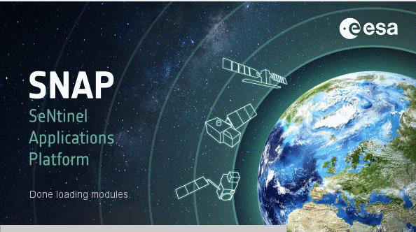
<h4 id="Sección1">Fig. 1. Sentinel Toolbox (SNAP).</h4>

La descarga del software SNAP se puede realizar en la siguiente dirección electrónica
 

<a href="http://step.esa.int/main/download/snap-download/" target="_blank">http://step.esa.int/main/download/snap-download/</a>
 

Los requisitos computacionales mínimos son:
<li>Sistema operativo: Linux, Mac, Windows.</li>
<li>RAM: 8 GB Procesador Intel® Core™ i5-5 o sus equivalentes.</li>
<li>Espacio en disco mínimo 5GB</li>

<h2 id="Sección2">2. Introducción</h2>

La información confiable sobre la distribución espacial de las aguas superficiales es de importancia crítica en varias disciplinas científicas. El Radar de Apertura Sintética (SAR por sus siglas en inglés) es una forma efectiva de detectar inundaciones y monitorear cuerpos de agua en grandes áreas. Sentinel-1 es un nuevo SAR en banda-C disponible, que dada su resolución espacial y líneas de base temporal cortas, tienen el potencial de facilitar el monitoreo de los cambios en las aguas superficiales, que son dinámicos en el espacio y el tiempo.

Cabe destacar que la detección remota con sensores ópticos requieren de observaciones con productos de buena calidad, sin nubes o sombras de nubes para minimizar la confusión espectral de los datos (Shen et al., 2019), sin embargo, en zonas tropicales como el caso del área de estudio seleccionada, donde las coberturas nubosas son constantes y abundantes, su aplicación resulta limitada (Flores et al., 2019). Debido a este aspecto, se ha implementado el uso de la imágenes SAR, la cual despeja la limitante de la nubosidad y permite la obtención continua de información (Flores et al., 2019).

Se aplicó una metodología de detección de cambio y umbral para determinar inundaciones de 2 imágenes de SAR del sensor Sentinel-1 de la Agencia Espacial Europea (ESA por sus siglas en inglés). Se procesó la polarización VV, ya que esta presenta resultados de inundación más plausibles en este sensor (Clement. et al,. 2017).Se consideró como área de estudio la zona cercana a la llanura de inundación del Río Tempisque durante la tormenta tropical Nate, sucedido en entre el 4-11 de octubre de 2017.

<h3>2.1 Objetivos de aprendizaje:</h3>

<li>Comprender los pre-procesos de calibración de las imágenes SAR.</li>
<li>Describir los procesos de interacción de la señal SAR con la superficie terrestre.</li>
<li>Identificar ventajas y desventajas del uso de imágenes SAR en la detección de inundaciones.</li>
<li>Generar un mapa de inundaciones.</li>

<h3>2.2 Datos a dercargar</h3>

Se deben descargar dos imágenes de tipo GRD de Sentinel-1, estas se pueden obtener de forma gratuita en los siguientes enlaces:

Para ambos casos (Alaska Satellite Facility Vertex y Copernicus Open Access Hub) debe crear -en caso de no tenerse- una cuenta de acceso, para poder descargar datos de información satelital de los repositorios.

<h4>Alaska Satellite Facility Vertex</h4> 

Buscador de datos:
<a href="https://search.asf.alaska.edu/#/" target="_blank">https://search.asf.alaska.edu/#/</a>

Registro de cuenta:
<a href="https://urs.earthdata.nasa.gov/users/new" target="_blank">https://urs.earthdata.nasa.gov/users/new</a>

<h4>Copernicus Open Access Hub</h4>  

Buscador de datos:
<a href="https://scihub.copernicus.eu/dhus/#/home" target="_blank">https://scihub.copernicus.eu/dhus/#/home</a>

Registro de cuenta:
 <a href="https://scihub.copernicus.eu/dhus/#/self-registration" target="_blank">https://scihub.copernicus.eu/dhus/#/self-registration</a>

<h4>Conjunto de datos</h4>

<table style="width:100%">
  <tr>
    <th>Nombre del producto</th>
    <th>Fecha</th> 
    <th>Características</th>
  </tr>
  <tr>
    <td>S1A_IW_GRDH_1SDV_20170918T113029_20170918T113054_018429_01F07D_BCA3</td>
    <td>2017/09/18</td>
    <td>
Sentinel-1A

Polarización VV, VH

Órbita: Descendente

Modo: IW

Tipo: GRDH
</td>
  </tr>
  <tr>
    <td>S1A_IW_GRDH_1SDV_20171012T113030_20171012T113055_018779_01FB2A_7C27</td>
    <td>2017/10/12</td>
    <td>
Sentinel-1A

Polarización VV, VH

Órbita: Descendente

Modo: IW

Tipo: GRDH
</td>
  </tr>
</table>

<h2 id="Sección3">3. Pre-procesamiento</h2>

<h3>3.1 Importar imágenes del repositorio a SNAP.</h3>

Las imágenes descargadas se guardan como un archivo comprimido, estas no deben ser descomprimidas, ya que el SNAP interpreta la información en ese formato.
Use la opción <strong>File/ Open Product</strong> para importar las imágenes SAR del repositorio donde se encuentran los archivos RAR descargados.

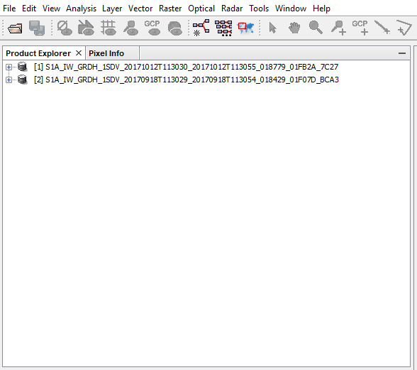
<h4 id="Sección2">Fig 2. Importar imágenes del repositorio.</h4>

<h3>3.2 Aplicación de un recorte (opcional) (subset).</h3>

Las imágenes SAR abarcan grandes áreas, por lo que para disminuir los tiempos de procesamiento se aplicó un recorte sobre el área de estudio.
Use la opción <strong>Raster/subset</strong>, en </strong>Spatial Subset seleccione Geo Coordinates (Fig 5) y coloque los siguientes valores.

<h2>Datos recorte</h2>

<table style="width:100%">
  <tr>
    <th>Bound</th>
    <th>Value</th> 
  </tr>
  <tr>
    <td>North latitude bound</td>
    <td>10.38</td>
  </tr>
  <tr>
    <td>West longitude bound</td>
    <td>-85.56</td>
  </tr>
  <tr>
    <td>South latitude bound</td>
    <td>10.28</td>
  </tr>
  <tr>
    <td>East longitude bound</td>
    <td>-85.70</td>
  </tr>
</table>

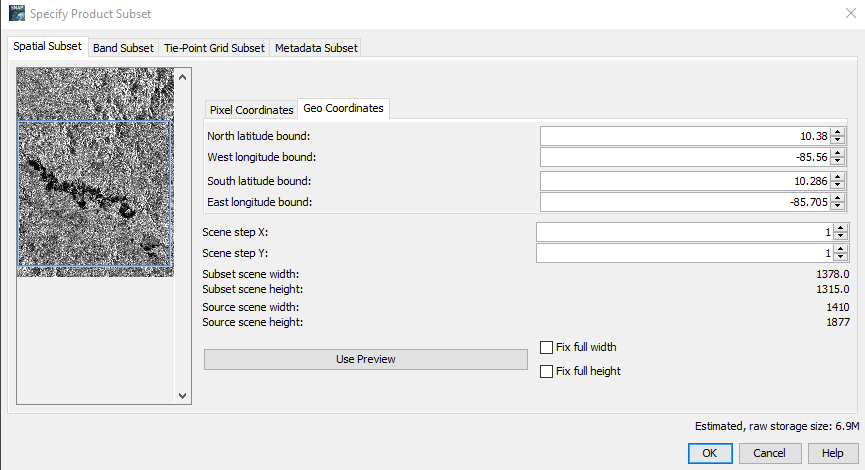
<h4 id="Sección3">Fig 3. Delimitación del área de estudio.</h4>

<h4 id="Sección3">Fig 4. Selección de la banda de polarización VV.</h4>

En la pestaña Band Subset el usuario puede recortar la banda de polarización a utilizar, en este caso se mantienen seleccionadas las bandas Amplitude_VV -hace referencia a los valores de amplitud obtenidos en la escena- y Intensity_VV -corresponde a los valores de amplitud al cuadrado- (Le Toan, 2007) (NASA - ARSET (Applied Remote Sensing training),2017), ya que con esta polarización se identificaran las inundaciones (Fig 4).Una vez realizado esto dar click en 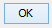.

El resultado del recorte corresponde a un archivo temporal, por lo que debe guardarse como una imagen nueva, seleccione el recorte y presione click derecho, use la opción <strong>Save Product As</strong> y elija una ruta de salida. <strong>Este proceso se debe realizar para ambas imágenes</strong>.

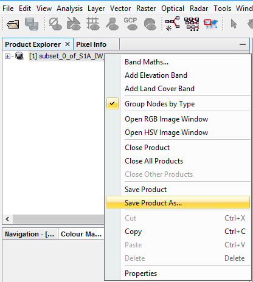
<h4 id="Sección3">Fig 5. Selección de la banda de polarización VV.</h4>

<h3>3.3 Aplicación de Órbita /Apply Orbit File.</h3>

El primer paso para el procesamiento de imágenes SAR, es aplicar un archivo de órbita preciso para mejorar la geocodificación del producto, es decir cargar los metadatos de órbita con el archivo de órbita de la imagen de referencia.

Use la opción <strong>Radar/ Apply Orbit File</strong>

Seleccione el recorte al que desea aplicar los archivos de órbita y señala el directorio de salida (Fig 6).Una vez realizado dar click en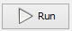.

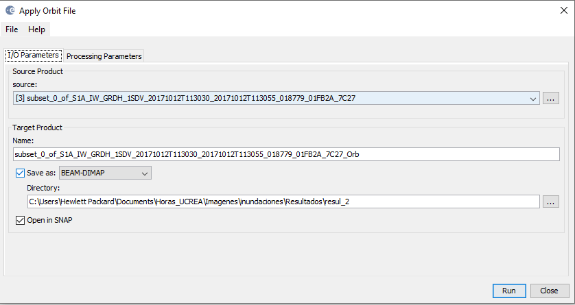
<h4 id="Sección3">Fig 6. Selección del recorte de aplicación de los archivos de órbita y el directorio de salida.</h4>

En la sección de parámetros de procesamiento (Fig 7) dejar las opciones por defecto.Una vez realizado dar click en.

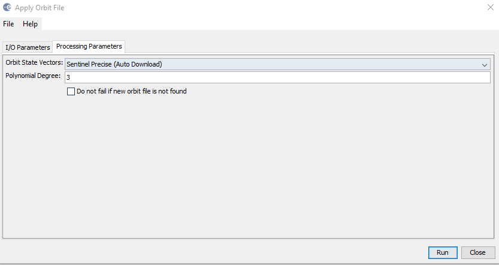
<h4 id="Sección3">Fig 7. Parámetros de procesamiento.</h4>

Resultados del subset y el aplicación de los archivos de órbita.

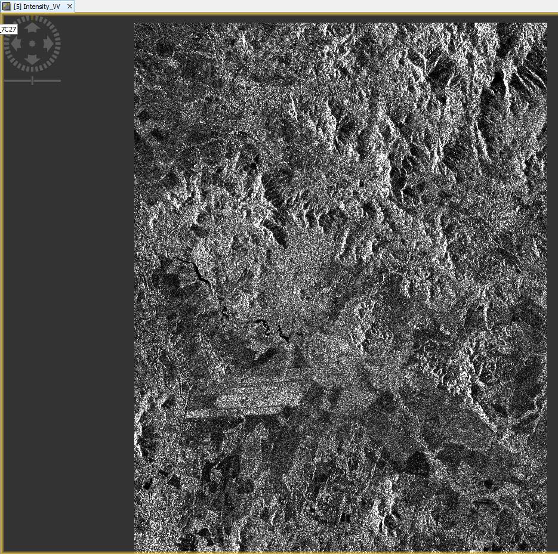
<h4 id="Sección3">Fig 8. Recorte y aplicación de órbita en imagen de 18-09-2017, VV.</h4>

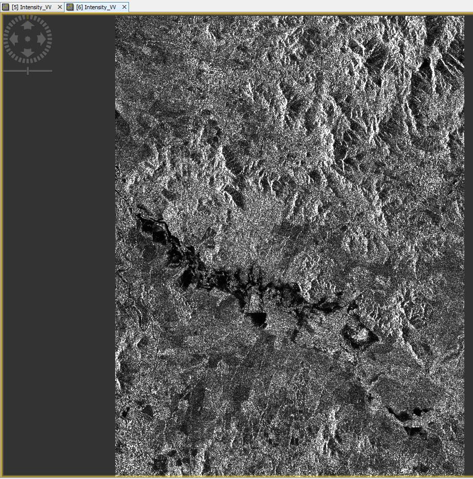
<h4 id="Sección3">Fig 9. Recorte y aplicación de órbita en imagen de 12-10-2017, VV.</h4>

<h3>3.4 Calibración Radiométrica /Radiometric calibration.</h3>

 El proceso de calibración radiométrica permite asociar el valor de los píxeles de la escena directamente con el reflejo de las microondas de la superficie de la imagen (Environmental Systems Research Institute (ESRI), 2019). Este proceso es indispensable para la ejecución de análisis cuantitativos a partir de imágenes SAR (EO4SD (Earth Observation for Sustainable Development), n.d).

Use la opción <strong>Radar/Radiometric/Calibrate.</strong>

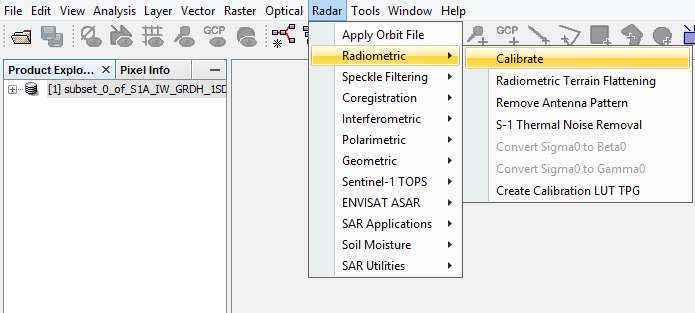
<h4 id="Sección3">Fig 10. Acceso a la herramienta de corrección radiométrica.</h4>

Seleccione el recorte de interés en <strong>Source Parameters</strong> y defina la ruta de salida en <strong>Directory</strong>. <strong>Los parámetros de proceso se dejan por defecto. Este proceso se debe realizar para ambas imágenes.</strong>

Una vez realizado dar click en .

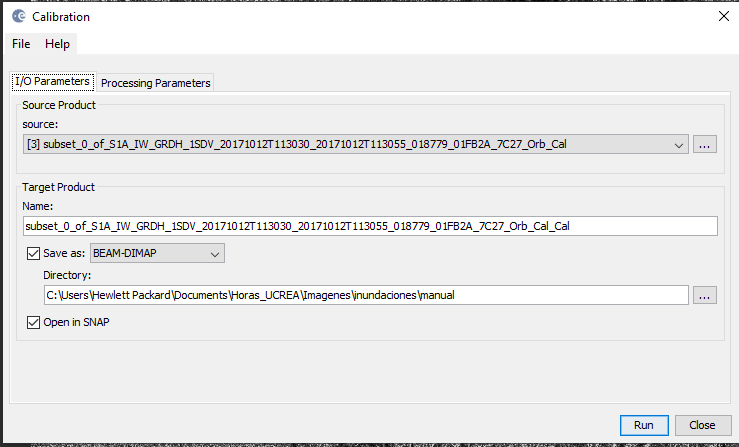
<h4 id="Sección3">Fig 11. Parámetros de corrección radiométrica.</h4>

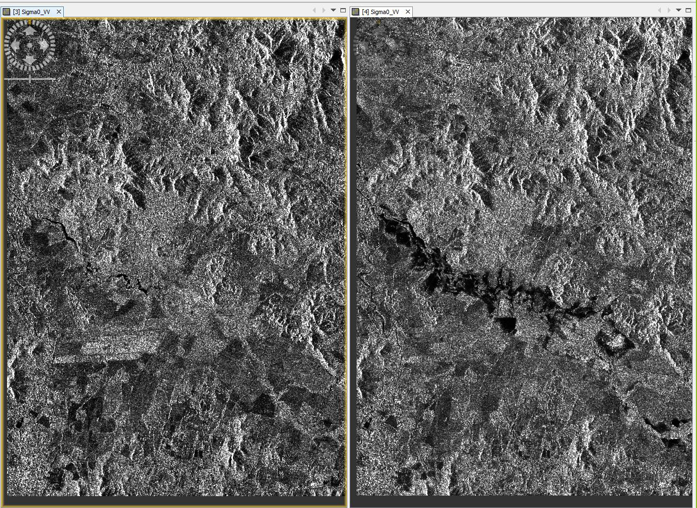
<h4 id="Sección3">Fig 12. Aplicación de corrección radiométrica, imagen izquierda 18-09-2017 VV, imagen derecha 12-10-2017, VV.</h4>

<h3>3.5 Filtro de moteado/Speckle filter.</h3>

El moteado es una distorsión en las imágenes SAR, que se manifiesta como una estructura granular, conocido como efecto “sal y pimienta”, esta distorsión es inherente en imágenes SAR y es el resultado de la interferencia de los ecos de la retrodispersión (EO4SD (Earth Observation for Sustainable Development), n.d y Flores et al., 2019).

Use la opción <strong>Radar/Speckle Filtering/Single Product Speckle Filtering.</strong>

Seleccionar el objeto deseado en la sección <strong>Source</strong> y en <strong>Directory</strong> establezca el repositorio de salida.

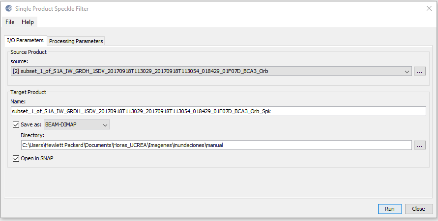
<h4 id="Sección3">Fig 13. Selección del objeto que posee el recorte y los archivos de órbita aplicados.</h4>

Selecciona las bandas -Source Bands para corregir el ruido de moteado (Fig 14).
En Filter se puede seleccionar el filtro deseado para realizar la corrección.
Una vez realizado dar click en .

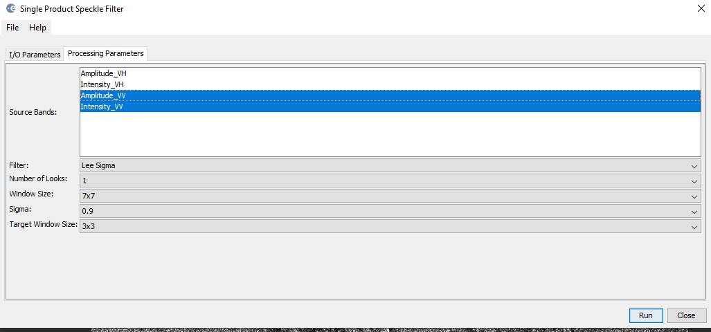
<h4 id="Sección3">Fig 14. Establecimiento de los parámetros del filtro para la imagen de salida.</h4>

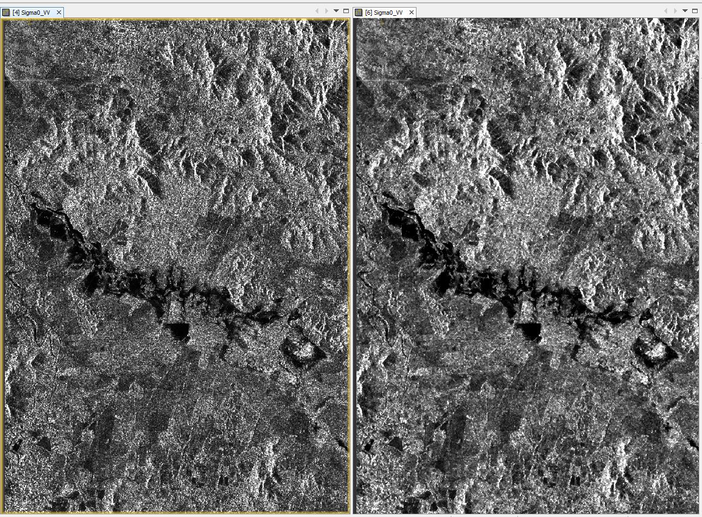
<h4 id="Sección3">Fig 15. Aplicación de filtro de Speckle. Imagen izquierda sin filtro, imagen derecha con filtro 12-10-2017, VV.</h4>

<h3>3.6 Corrección de Terreno / Terrain correction</h3>

El objetivo de este proceso es corregir las distorsiones del terreno que se presentan en la escena de la imagen (Flores et al., 2019). El proceso tiene como requisito el uso de un Modelo Digital de Terreno (MDE), se puede utilizar los repositorios de MDE que SNAP proporciona para realizar el proceso.

Use la opción <strong>Radar/Geometric/Terrain Correction/Range-Doppler Terrain Correction</strong> (Fig 16).

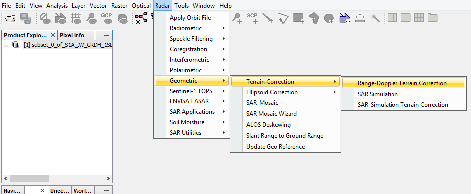
<h4 id="Sección3">Fig 16. Acceso a la herramienta de corrección de terreno.</h4>

Al igual que en los pasos anteriores seleccionar el objeto deseado en la sección Source y en Directory establezca el repositorio de salida.

Dejar las opciones de parámetros por defecto, note que el MDE es seleccionado de forma automática con una resolución de 3 segundos de arco (Fig 17).

Una vez realizado los pasos anteriores dar click en.

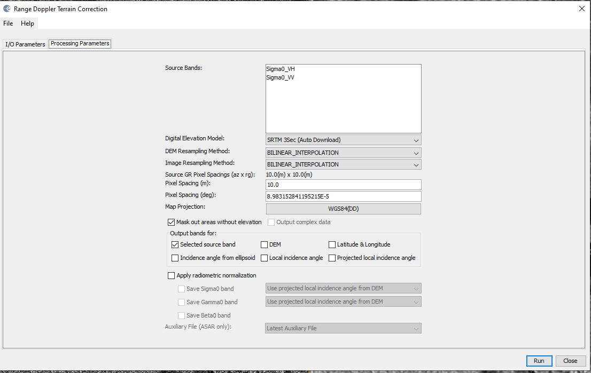
<h4 id="Sección3">Fig 17. Selección de parámetros herramienta de corrección de terreno.</h4>

A continuación se muestran los resultados de la corrección de terreno (Fig 18).

  
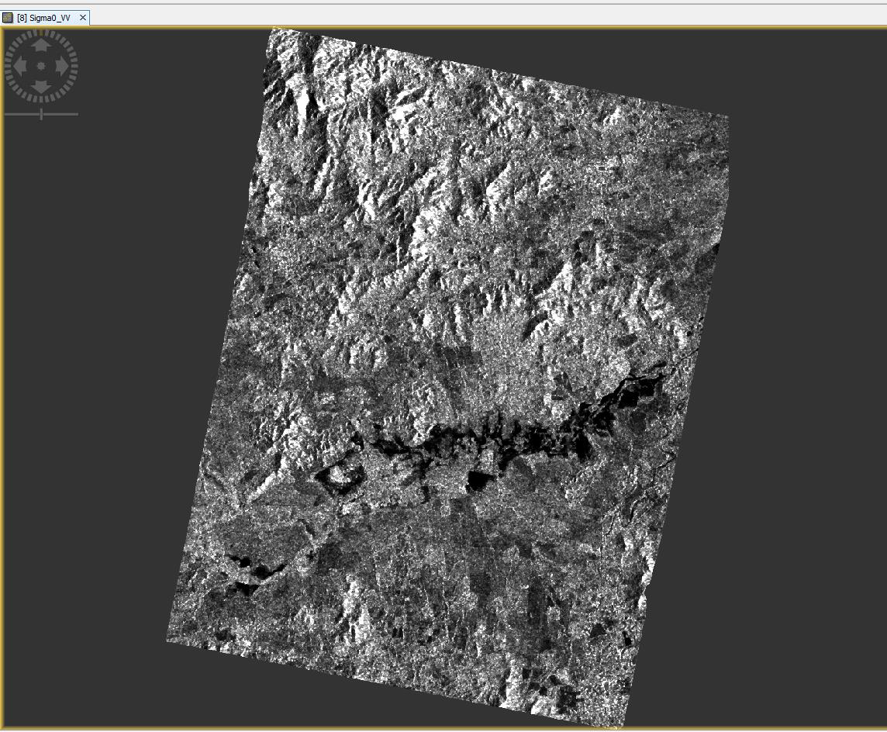
<h4 id="Sección3">Fig 18. Aplicación de corrección de terreno. 12-10-2017, VV.</h4>

Una vez aplicada la corrección de terreno las imágenes se encuentran debidamente calibradas para el proceso de detección de inundaciones. Por otro lado, SNAP ofrece la posibilidad de ejecutar estos procesos en conjunto mediante la construcción de un gráfico. Para esto use la opción <strong>Graph Builder</strong> 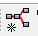 Seleccione los parámetros de acuerdo a los pasos explicados previamente (Fig 19).

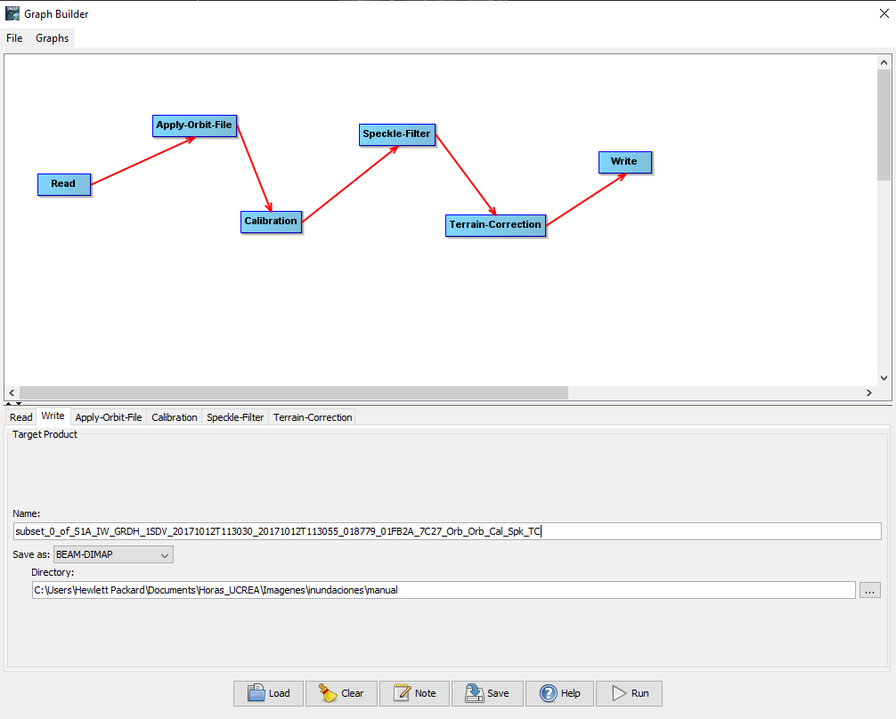
<h4 id="Sección3">Fig 19. Creación de un gráfico para el procesamiento conjunto de imágenes SAR en SNAP.</h4>

<h2 id="Sección4">4. Procesamiento para detección de inundaciones</h2>

<h3>4.1 Crear un apilado/stack de las imágenes procesadas.</h3>

Con las imágenes debidamente preprocesadas el siguiente paso consiste en la elaboración de un archivo que compile las dos imágenes:

<li>subset_0_of_S1A_IW_GRDH_1SDV_20171012T113030_20171012T113055_018779_01FB2A_7C27_Orb_Cal_Spk_TC.data</li>

<li>subset_1_of_S1A_IW_GRDH_1SDV_20170918T113029_20170918T113054_018429_01F07D_BCA3_Orb_Cal_Spk.data</li>

Para esto use la opción <strong>Radar/Coregistration/Stack Tools/Create Stack</strong> (Fig 20).

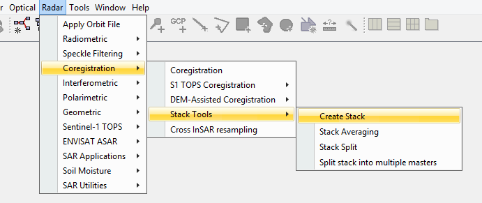
<h4 id="Sección4">Fig 20. Acceso a la herramienta de apilar imágenes SAR.</h4>

Añadir las imágenes a la herramienta usando la opción . Se recomienda ordenar las imágenes respecto a la línea temporal,en primer lugar la imagen antes del evento de inundación (18Sept2017) y luego la imagen posterior a la inundación (12Oct2017) (Fig 21).

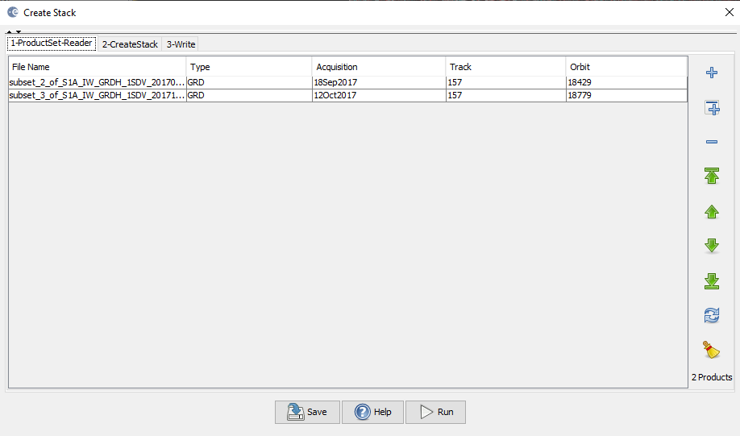
<h4 id="Sección4">Fig 21. Selección de las imágenes a apilar.</h4>

En la pestaña <strong>2-CreateStack/ Initial Offset Method</strong> seleccione la opción <strong>Product Geolocation</strong>, ya que ambas imágenes han sido debidamente calibradas en órbita, Geométrica y radiométrica en pasos previos (Fig 21).

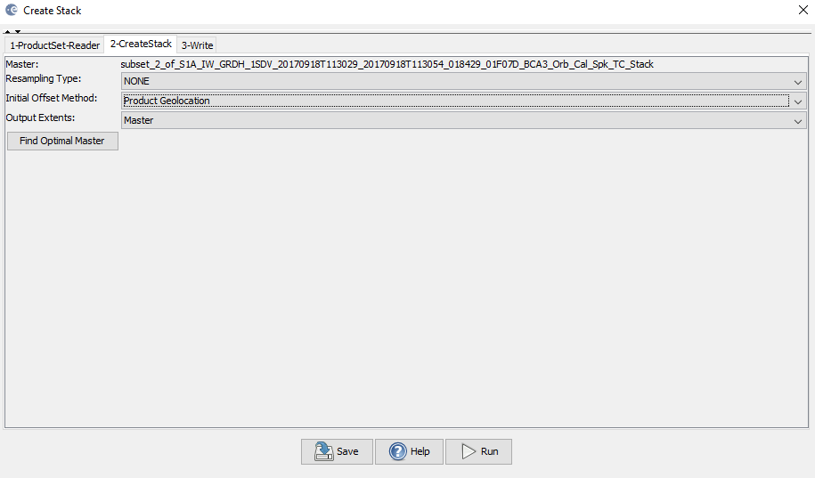
<h4 id="Sección4">Fig 22. Parámetros de procesamiento en la creación del apilado.</h4>

Una vez hecho esto seleccione la ruta de salida en la pestaña Write/Directory y presione .

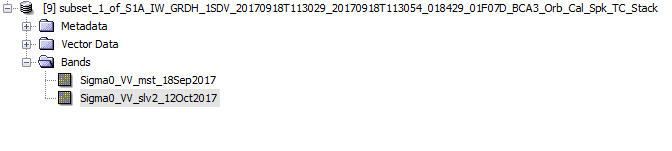
<h4 id="Sección4">Fig 23. Resultado del compilamiento de las imagenes.</h4>

<h3>4.2 Vista previa de inundaciones.</h3>

Creación de RGB para visualización previa de los cambios entre las dos imágenes (Fig 24). Nótese los valores en tonos rojos y azules que se encuentran cerca de las llanuras de inundación.

Seleccione el apilado creado y presione click derecho , <strong>Open RGB Image Window.</strong>

Establezca en el canal <strong>Red</strong> Sigma0_VV_slv2_12Oct2017, en el canal <strong>Green</strong> Sigma0_VV_mst_18Sep2017 y en el canal <strong>Blue</strong> Sigma0_VV_mst_18Sep2017.

Una vez realizado el paso anterior presione .

  
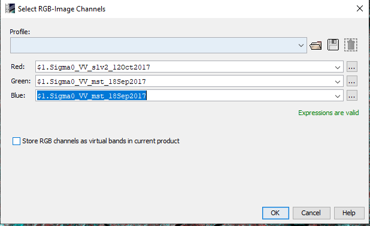
<h4 id="Sección4">Fig 24. Creación de RGB para visualización.</h4>

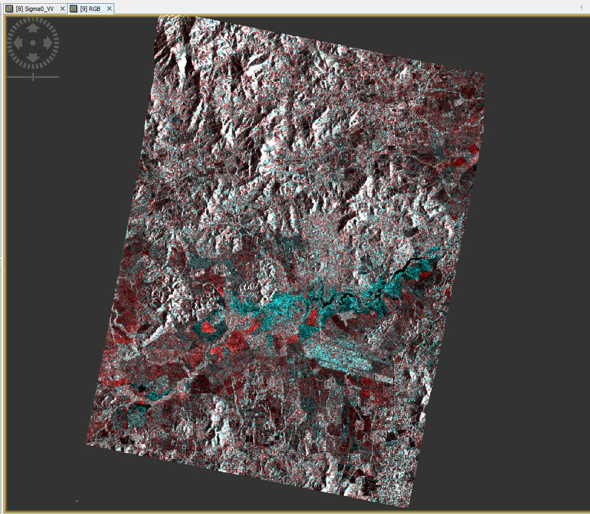
<h4 id="Sección4">Fig 25. Resultado del RGB -valores en tonos de azul representan una disminución en los valores de retrodispersión, lo que se relaciona con una lámina de agua (retrodispersión especular) y en rojo valores donde la retrodispersión aumentó, asociado a la presencia de vegetación inundada (retrodispersión por doble rebote).</h4>

<h3>4.3 Algoritmo de detección de cambio/ change detection</h3>

Se pretende generar una escala logarítmica de la imagen y una obtención de la proporción de la imagen (Ratio image formation) (fórmula 1) utilizando la herramienta de SNAP <strong>Change Detection</strong> (Fig 26). La fórmula de proporción de imagen, se basa en la proporción de la imagen de reciente adquisición Xi y la imagen de referencia XR, la imagen generada puede ser modelada mediante la siguiente fórmula:

  
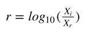 
Fórmula 1. Proporción de las imágenes utilizadas, donde xi es la imagen después del evento y xr es la imagen de referencia antes del evento de inundación.

La intención de la imagen generada es mejorar la detección potencial de cambios entre las imágenes 18-09-2017, VV & 12-10-2017, VV (Flores et al., 2019) (Fig 28).

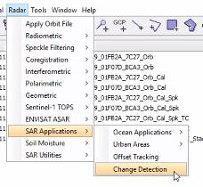
<h4 id="Sección4">Fig 26. Herramienta de detección de cambio en SNAP.</h4>

Seleccione las imágenes de referencia antes del evento y después del evento para la polarización VV en la sección de <strong>Source Bands</strong>.

Seleccione Output Log Ratio para obtener una imagen de la proporción realizada r.

Una vez hecho el paso anterior presione.

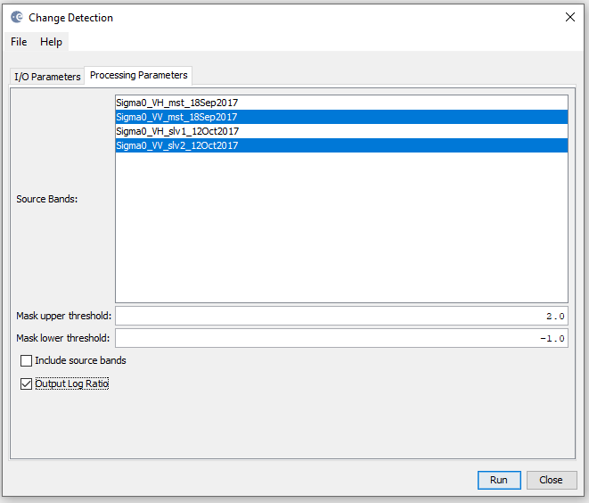
<h4 id="Sección4">Fig 27. Selección de los parámetros de detección de cambios.</h4>

En la selección de los parámetros de <strong>Mask upper threshold y Mask lower threshold</strong> (Fig 26) se deben establecer los valores de umbral -filtrado por valor establecido- tanto positivos como negativos de desviación estándar, basado en los datos obtenidos de la proporción del logaritmo aplicado, lo cual da como resultado un enmascaramiento de la imagen r (Fig 28).

En este ejemplo se seleccionó para <strong>Mask upper threshold = 2</strong> y para <strong>Mask lower threshold = -1</strong> (Fig 26).

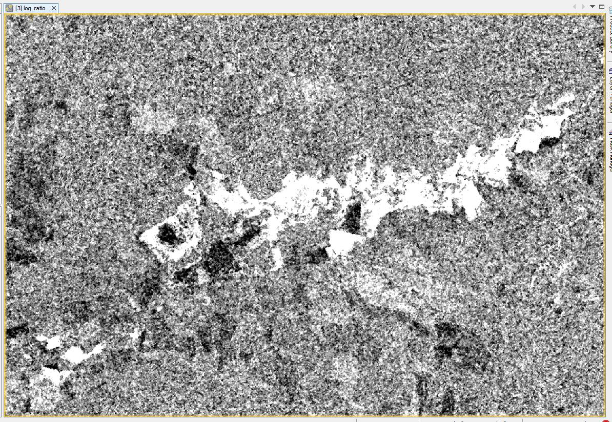
<h4 id="Sección4">Fig 28. Resultado del proceso de detección de cambio sin enmascaramiento.</h4>

Lo valores con tonalidades más claras representan zonas de cambio en el intervalo positivo (>2), que se relacionan con zonas de retrodispersión especular, en este caso <strong>inundaciones de aguas abiertas</strong>. En el caso de los valores con tonos más oscuros representan zonas de cambio en el intervalo negativo (<-1), que se relacionan con zonas de vegetación inundada (Fig 29).

La detección de zonas de inundación bajo coberturas (cultivos, pastos, bosques, manglares, etc.), va estar ligada a su estructura y densidad, ya que este puede evitar que el pulso energético del sensor penetre la cobertura, lo que limitaría la detección de inundaciones y se reportarían sin cambio. Por lo tanto, la detección de vegetación inundada será más precisa con longitudes de onda largas (por ejemplo banda L), ya que esto favorece la penetración del haz energético en distintas coberturas.

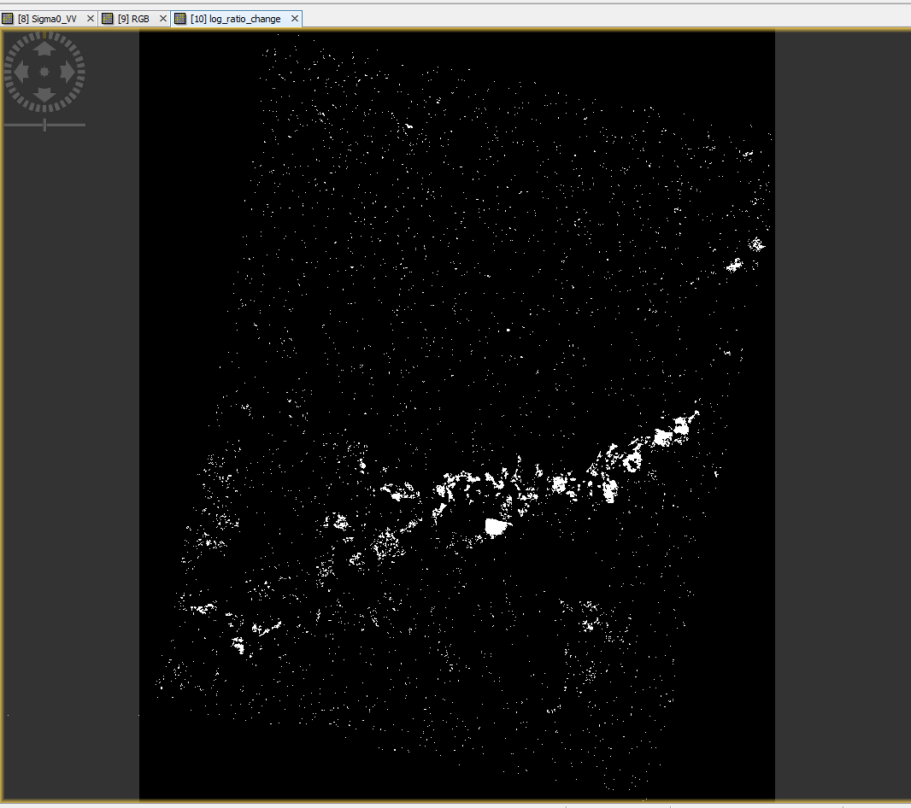
<h4 id="Sección4">Fig 29. Resultado del proceso de detección de cambio, con enmascaramiento.</h4>

<h3>4.4 Filtro de altitud.</h3>

Los resultados de detección de cambio presentan una serie de falsos positivos, que pueden estar relacionados a cambios en las condiciones atmosféricas, así como el contenido de humedad entre una imagen y otra, de igual forma, aspectos como la topografía pueden influir en la detección de estas falsos positivos, que se manifiestan en forma de ruido en la imagen generada.

Agregue una banda de elevación al archivo con el resultado obtenido del proceso de detección de cambios, presionando click derecho sobre el archivo y seleccione Add Elevation Band.

Una vez abierta la herramienta (Fig 30), seleccione el MDE de preferencia y presione .

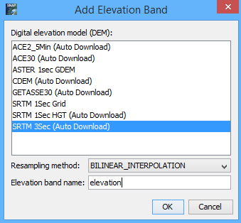
<h4 id="Sección4">Fig 30. Añadir MDE al archivo con el resultado del enmascaramiento.</h4>

Para disminuir este ruido se aplicó un filtro basado en la elevación, para esto seleccione la imagen log_ratio y presione click derecho y elija <strong>Band Maths…</strong> (Fig 31). Una vez en la calculadora de bandas, seleccione <strong>Edit Expression…</strong>, proceda a insertar la siguiente expresión: <strong>log_ratio > 2 && elevation < 50</strong>. Esto permitirá obtener solo las zonas de cambio del intervalo positivo que se encuentren en elevaciones menores a los 50 msnm, relacionadas con las llanuras de inundación (Fig 21). Ejecute esto nuevamente para filtrar las los valores de cambio del intervalo negativo < -1, mediante la expresión: <strong>log_ratio < -1 && elevation < 15</strong>.

Se recomienda ajustar estos filtros basados en valoraciones de terreno, en este caso, los valores de altitud responden a las situaciones particulares del área de estudio, es decir, estos deben ajustarse según sea el caso y el lugar de interés debido a las variaciones espaciales entre un área y otra. De igual forma, se insta al usuario de este manual a experimentar con otros valores de la altitud y evaluar sus resultados.

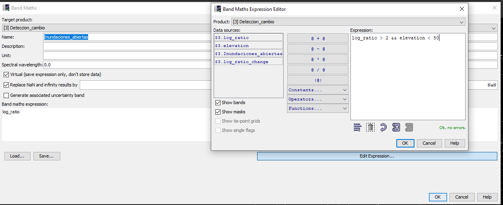
<h4 id="Sección4">Fig 31. Band Maths.</h4>

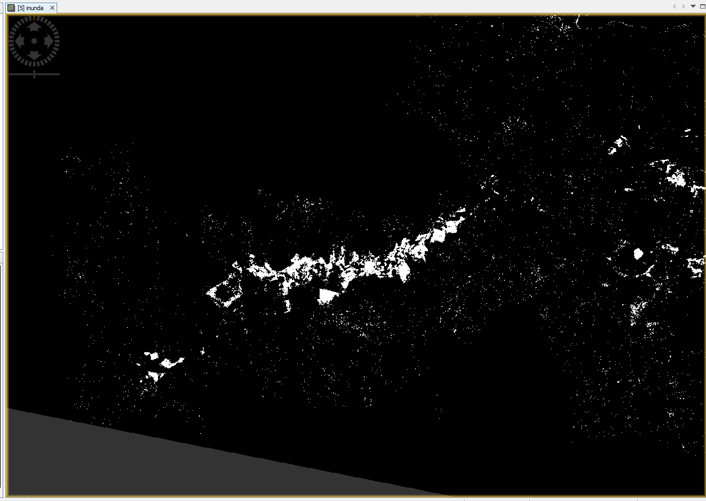
<h4 id="Sección4">Fig 32. Imagen binaria de Inundaciones abiertas (disminución en la retrodispersión), colores blancos representan zonas inundadas.</h4>

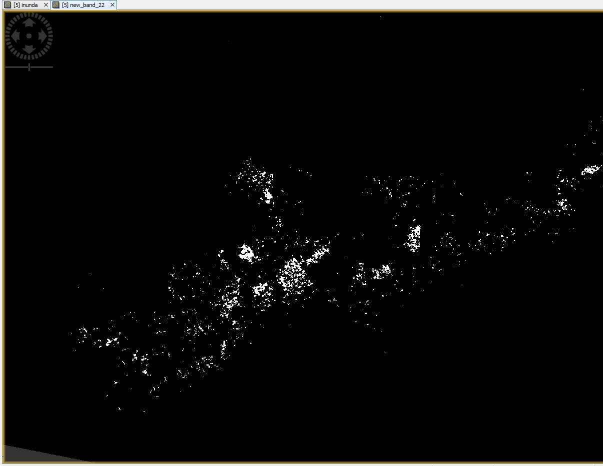
<h4 id="Sección4">Fig 33. Imagen binaria de inundación bajo cobertura (incremento en retrodispersión), colores blancos representan zonas inundadas.</h4>

<h3>4.5 Exportar de datos</h3>

Para exportar los datos obtenidos del proceso y poder observarlos en un programa por aparte a SNAP, presione <strong>File/Export</strong>/ y establezca el formato deseado (Fig 34), en este caso se ha establecido como formato de salida <strong>GeoTIFF</strong> (Fig 34).

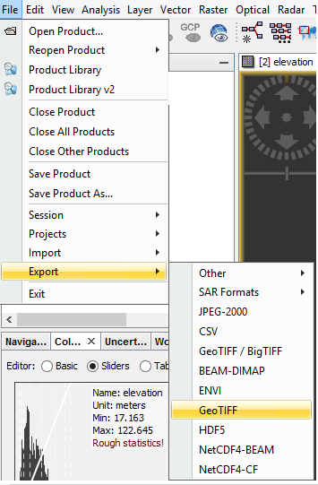
<h4 id="Sección4">Fig 34. Proceso de exportación de datos desde SNAP.</h4>

Una vez seleccionado GeoTIFF le aparecerá la venta donde debe seleccionar el directorio de salida (Fig 35). Una vez realizado este paso presione 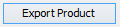.

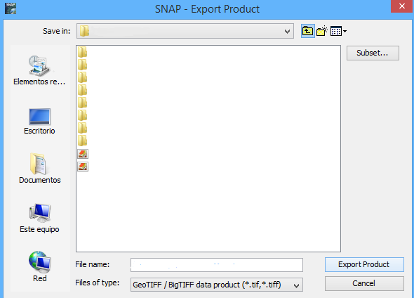
<h4 id="Sección4">Fig 35.Selección del directorio de salida del archivo a exportar.</h4>

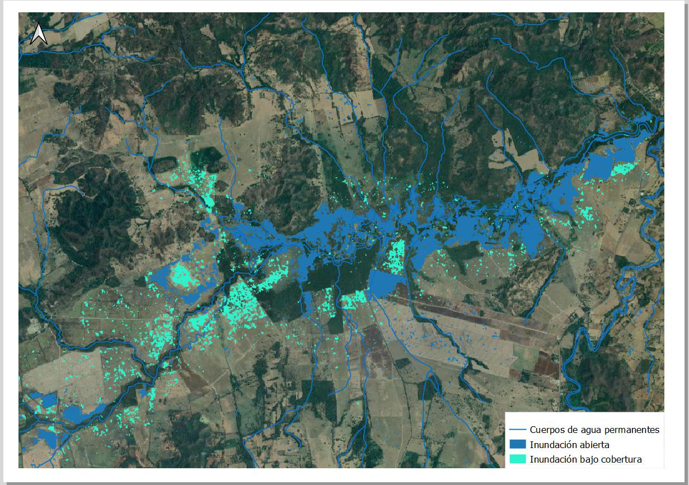
<h4 id="Sección4">Fig 36. Resultados de los procesos visualizados en el software libre QGIS.</h4>

El resultado mostrado en la Fig 36 se filtró por área y se eliminaron valores menores a 300 m2 para el caso de las zonas de Inundación abierta y para el caso de las zonas de Inundación bajo cobertura con valores menores 150 m2.

<h2 id="Sección5">5. Recomendaciones</h2>

La detección de inundaciones a partir de imágenes SAR presenta una serie de ventajas, como la obtención de información libre de nubosidad y la continuidad en la obtención de datos, aunque, su aplicación se encuentra ligada a los periodos de revisita del sensor y su coincidencia con el evento de inundación.

Para mejorar la precisión de los resultados se recomienda un análisis de línea de tiempo, mediante el uso de una imagen multi-temporal promedio para el periodo antes del evento y su contraste con una imagen posterior al evento.

Para los casos donde se comprenda grandes áreas de estudio, se recomienda la ejecución de un proceso por secciones o lotes, con el fin de establecer umbrales de cambio locales con el fin de abordar las diferencias en retrodispersión generadas por las distintas coberturas y los cambios en la topografía. Por otro lado, se recomienda un análisis estadístico más riguroso para la selección de un umbral ideal.

Múltiples estudios (Clement. et al, 2017) señalan la polarización VV del para el caso del sensor Sentinel-1 como la polarización más adecuada para el estudio de inundaciones, esto en comparación a la polarización VH, que suele sobreestimar los resultados detectados.

A pesar de lo anterior, las zonas inundadas bajo vegetación son difíciles de identificar, para la longitud de onda del Sensor Sentinel-1 (banda C), en muchos casos no logra penetrar las coberturas, detectándose como un área sin cambio. Por lo tanto, la detección de vegetación inundada será más precisa en sensores SAR con mayor longitud de onda (banda L).

Para más detalles puede ver el siguiente video tutorial, donde se ilustran los pasos para ejecutar lo mostrado en este manual:

<iframe width="420" height="315" src="https://www.youtube.com//embed//Dj2tESY56DI/"></iframe>

<h2 id="Sección6">6. Bibliografía</h2>

Clement, M. A., Kilsby, C. G., & Moore, P. (2017). Multi-temporal synthetic aperture radar flood mapping using change detection. Journal of Flood Risk Management, 11(2), 152-168. <a href="https://doi.org/10.1111/jfr3.12303" target="_blank">https://doi.org/10.1111/jfr3.12303</a>

Environmental Systems Research Institute (ESRI). (2019). Calibración radiométrica de Sentinel-1—Ayuda | ArcGIS Desktop. ArcGIS Desktop. <a href="https://desktop.arcgis.com/es/arcmap/latest/manage-data/raster-and-images/sentinel-1-radiometric-calibration.htm" target="_blank">https://desktop.arcgis.com/es/arcmap/latest/manage-data/raster-and-images/sentinel-1-radiometric-calibration.htm</a>

Le Toan, T. (2007). Introduction to SAR Remote Sensing Lecture. <a href=" https://earth.esa.int/landtraining07/D1LA1-LeToan.pdf" target="_blank"> https://earth.esa.int/landtraining07/D1LA1-LeToan.pdf</a>

Flores-Anderson, A. I., Herndon, K. E., Bahadur Thapa, R., & Cherrington, E. (Eds.). (2019). The Synthetic Aperture Radar (SAR) Handbook: Comprehensive Methodologies for Forest Monitoring and Biomass Estimation. <a href="https://doi.org/10.25966/nr2c-s697" target="_blank"> https://doi.org/10.25966/nr2c-s697</a>

NASA - ARSET (Applied Remote Sensing training). (2017). NASA Remote Sensing for Flood Monitoring and Management Accessing SAR Data Objectives.  <a href="https://arset.gsfc.nasa.gov/sites/default/files/disasters/Dewberry/S2E4.pdf" target="_blank"> https://arset.gsfc.nasa.gov/sites/default/files/disasters/Dewberry/S2E4.pdf</a>

Shen, W., Li, M., Huang, C., Tao, X., Li, S., & Wei, A. (2019). Mapping annual forest change due to afforestation in Guangdong Province of China using active and passive remote sensing data. Remote Sensing, 11(5), 1-21. <a href="https://doi.org/10.3390/rs11050490" target="_blank"> https://doi.org/10.3390/rs11050490</a>

Tsyganskaya, V., Martinis, S., Marzahn, P., & Ludwig, R. (2018a). Detection of temporary flooded vegetation using Sentinel-1 time series data. Remote Sensing, 10(8).  <a href="https://doi.org/10.3390/rs10081286" target="_blank"> https://doi.org/10.3390/rs10081286</a>

Tsyganskaya, V., Martinis, S., Marzahn, P., & Ludwig, R. (2018b). SAR-based detection of flooded vegetation–a review of characteristics and approaches. En International Journal of Remote Sensing (Vol. 39, Número 8, pp. 2255-2293). Taylor and Francis Ltd. <a href="https://doi.org/10.1080/01431161.2017.1420938" target="_blank"> https://doi.org/10.1080/01431161.2017.1420938</a>

